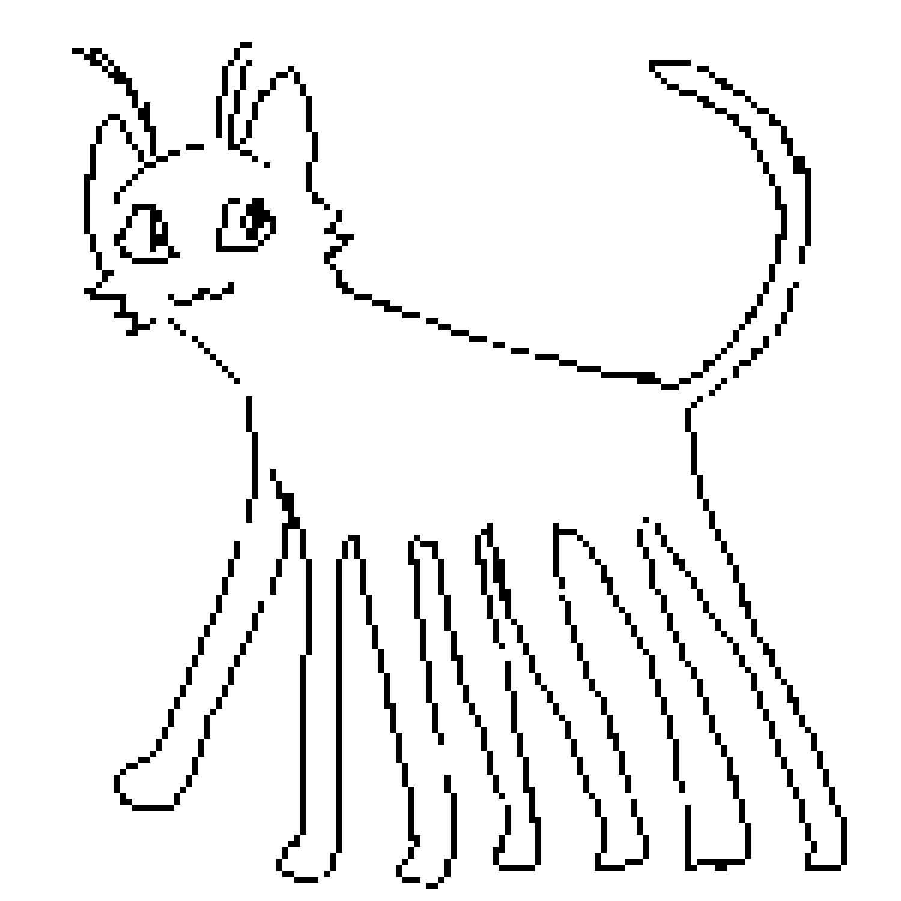

## How to run locally
- Create `secrets/secrets.json` file conforming to Secrets interface
- Run using vscode launch configuration

## How to run dockerised development environment
- Create `secrets/test.secrets.json` file conforming to Secrets interface
- Build and run with `docker-compose-build-test.yml` compose file